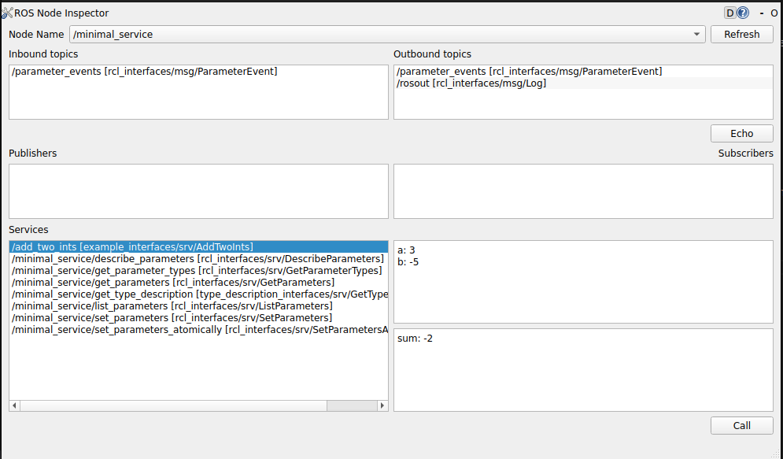

### rqt_node_inspector

#### Summary
An rqt plugin that allows a user to view all available connections (subscribers/publishers) on a given Node.

- View inbound and outbound connections of a given node
- View all publishers and subscribers for a given topic
- Echo a particular topic

`ros2 run rqt_node_inspector rqt_node_inspector`

#### Future work
- There is an overlap with `rqt_topic` in that this also displays a list of connections. `rqt_node_inspector` could be improved by including the same introspective capabilties as rqt_topic (such as bandwidth and frequency).

